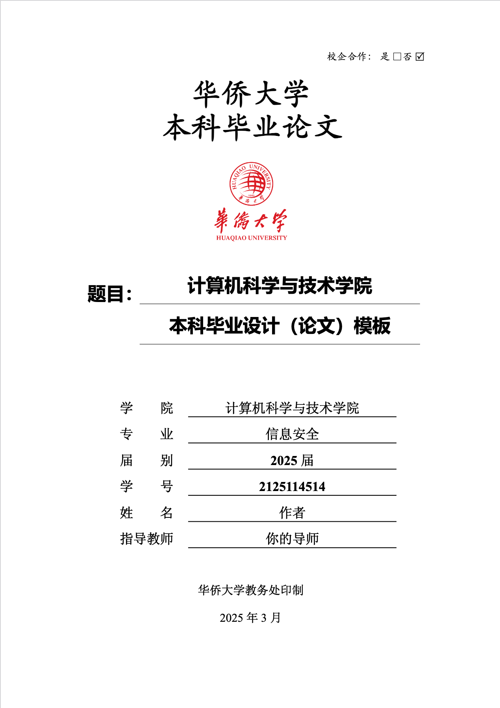

# 华侨大学本科毕业论文 Typst 模板

本项目提供用于华侨大学本科毕业论文撰写的 Typst 模板。

## 项目结构  
```
.
├── assets/            # 学校标识/图表资源
├── fonts/             # 所需字体文件
├── utilites/          # 论文组件模块
│   ├── abstract.typ   # 中英文摘要
│   ├── cover.typ      # 论文封面 
│   └── ...            
├── main.typ           # 主文档
├── hqu-thesis.typ     # 论文模板主体
└── references.bib     # 参考文献数据
```

## 预览  

[示例PDF](./template.pdf)



## 快速开始

### 克隆本仓库
```bash
git clone https://github.com/aBER0724/HQU-Thesis-Typst-Template.git
```

进入`fonts`目录安装所需的字体  
- 中文字体：宋体、黑体、楷体、仿宋  
- 英文字体: Times New Roman  

### 复制模板
```bash
cd HQU-Thesis-Typst-Template
cp template.typ main.typ
```

### 编译论文  
```bash
typst compile main.typ
```