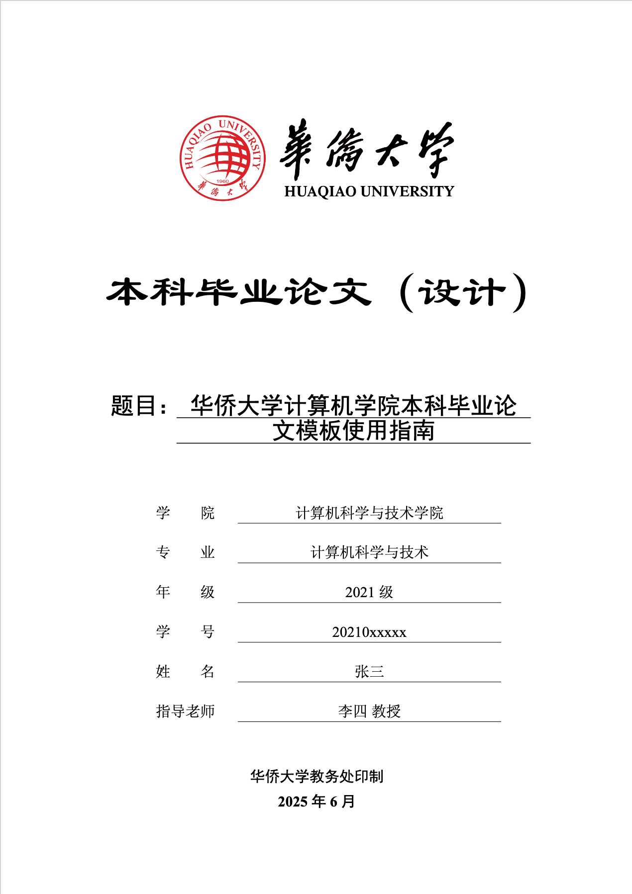

# 华侨大学本科毕业论文 Typst 模板

> 本项目 ⚠️ **非官方模板** ⚠️ 仅参考华侨大学本科毕业论文撰写的 Typst 模板.  
> 使用本模板生成的 PDF 文件 ⚠️ **不保证通过格式检查** ⚠️.

## 项目结构

```text
.
├── assets/            # 资源
├── fonts/             # 字体文件
├── utilites/          # 论文组件模块
│   ├── abstract.typ          # 中英文摘要
│   ├── acknowledgement.typ   # 致谢
│   ├── basic-style.typ       # 基础样式
│   ├── cover.typ             # 论文封面
│   ├── equation.typ          # 数学公式
│   ├── figure.typ            # 图片样式
│   ├── reference.typ         # 参考文献样式
│   └── table-of-contents.typ # 目录
├── template.typ       # 论文主文件
├── hqu-thesis.typ     # 论文样式文件
├── references.bib     # 参考文献数据
└── algorithms.typ     # 算法伪代码文件
```

## 预览  

[示例 PDF](./template.pdf)

|未匿名|匿名|
|:---:|:---:|
|||

## 快速开始

### 克隆本仓库

```bash
git clone https://github.com/aBER0724/HQU-Thesis-Typst-Template.git
```

进入 `/fonts` 目录安装所需的字体  

- 中文字体：宋体、黑体、楷体、仿宋、隶书  
- 英文字体: Times New Roman  

### 编译论文

编译论文生成 pdf 文件  

```bash
typst compile main.typ
```

## 使用注意

### 封面信息

封面信息在 `main.typ` 顶部中已定义请自行修改. 变量包括:

|变量|备注|
|---|---|
|`title`|论文题目|
|`author`|姓名|
|`grade`|年级|
|`student-id`|学号|
|`department`|学院|
|`major`|专业|
|`supervisor`|指导老师|
|`date`|论文完成时间|
|`keywords`|中文关键词|
|`keywords-en`|英文关键词|
|`abstract`|中文摘要|
|`abstract-en`|英文摘要|
|`acknowledgement`|致谢|
|`is-redact`|是否匿名, 需要进行匿名处理的部分填入 `#redact(XXX, enabled: is-redact)`, 将变量值改为 `true` 启用匿名, 默认不启用.|

### 加粗

使用 `show-cn-fakebold` 库, 使用 `*` 包裹需要加粗的文字, 例如: `*Bold it*`.

### 公式

使用 `$` 包裹公式代码, 注意这里使用的 Typst 的公式语法, 与 LaTeX 的公式语法有所区别, 详见[Typst-Math](https://typst.app/docs/reference/math/), 符合参考[Typst-Symbol](https://typst.app/docs/reference/symbols/sym/). 例如, `$ A = pi r^2 $`.

也可以使用 `#mitex()` 插入 LaTeX 语法的公式. 例如,

```Typst
#mitex(`
\newcommand{\f}[2]{#1f(#2)}
\f\relax{x} = \int_{-\infty}^\infty
\f\hat\xi\,e^{2 \pi i \xi x}
\,d\xi
`)
```

### 图片

使用 `figures-hqu()` 函数插入图片:  

1. 单张图片  

```Typst
#figures-hqu(
  figure(image("assets/校徽与中英文标准字中轴组合.png", width: 10cm)),
  caption: [华侨大学校徽示例],
)
```

2. 并排图片  

```Typst
#figures-hqu(
  (
    figure(image("assets/图片1.png", width: 6cm)),
    figure(image("assets/图片2.png", width: 6cm))
  ),
  caption: "总标题",
  individual-captions: ([图1标题], [图2标题])
)
```

### 表格

使用 `table-hqu()` 函数创建符合规范的三线表:  

```Typst
#table-hqu(
  caption: "表格标题",
  header-bold: true,
  data: (
    ("表头1", "表头2", "表头3"),
    ("数据1", "数据2", "数据3"),
    ("数据4", "数据5", "数据6")
  )
)
```

### 引用文献

将引用的文献的 `BibTeX` 粘入 `references.bib`, 例如:

```BibTeX
@article{girshick2014rich,
  title={Rich feature hierarchies for accurate object detection and semantic segmentation},
  author={清华大学.参考文献及论文写作格式论文},
  journal={Proceedings of the IEEE conference on computer vision and pattern recognition},
  pages={580--587},
  year={2014}
}
```

在引用文献处插入 `#bib_cite(<girshick2014rich>)` 即可引用, 若需要引用多篇文献, 在括号中继续填即可 `#bib_cite(<girshick2014rich>,<redmon2016you>)`.

### 算法伪代码

使用以下格式编写伪代码:  

```Typst
cool: figure(
    kind: "algorithm",
    supplement: [Algorithm],

    pseudocode-list(booktabs: true, numbered-title: [My cool algorithm])[
      + do something
      + do something else
      + *while* still something to do
        + do even more
        + *if* not done yet *then*
          + wait a bit
          + resume working
        + *else*
          + go home
        + *end*
      + *end*
    ],
  )
```

在论文文件中, 使用 `#algorithms.cool <cool>` 插入伪代码. `cool` 为 `algorithms.typ` 中对伪代码的标识.

> 需要注意的是, 插入伪代码的下一段无法自动进行首行缩进, 如果需要保持首行缩进, 请在段首插入 `#h(2em)`.
